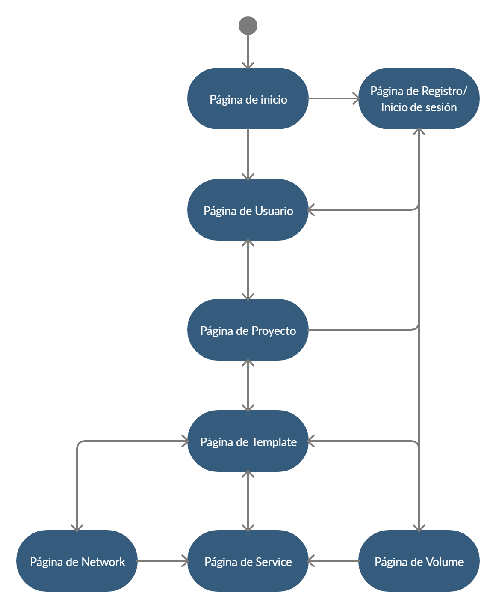

# EasyDocker
### Temática de la web
Se trata de una apliación que ofrece una capa de abstracción en la creación de arquitecturas de microservicios con 
docker. Los **usuarios registrados** podrán crear y guardar arquitecturas.

## Páginas principales
#### Página de Inicio
Pagina de inicio, podemos entrar a la aplicación como invitados, o registrándonos.

#### Página de Registro/Inicio de sesión

#### Página de Usuario
En esta página se muestran los proyectos del usuario, se pueden crear nuevos proyectos y acceder a la página de un 
proyecto particular.

#### Página de Proyecto
En esta página se muestran las templates de un proyecto, se pueden crear nuevas templates y acceder a la página de una 
template particular.

#### Página de Template
En esta página se muestran los services, networks y volumes de una template, se pueden crear nuevos services, networks y
volumes y acceder a la página de un service, network y volume particular.

#### Página de Service
En esta página se pueden modificar las properties de un docker en particular, generar su imagen y construirlo.

#### Página de Network
En esta página se pueden añadir services a una network y modificar sus properties.

#### Página de Volume
En esta página se pueden añadir services a un volume y modificar sus properties.

## Diagrama de navegación

## Modelo de datos
#### Entidades principales
- User: usuarios registrados en la aplicación  
- Template: estructura de los dockers y sus interacciones (conexiones, seguridad...)
- Proyect: conjunto de templates de un mismo Team o User
- Service: conjunto de dockers con sus propiedades
- Network: conjunto de networks dentro de un Service con sus propiedades
- Volumes: conjunto de volumes dentro de un Service con sus propiedades
#### Diagrama Entidad/Relación

#### Diagrama de clases UML

## Descripción de las funcionalidades del servicio interno
Se va a encargar de generar y construir los dockerfile y docker-compose mediante las especificaciones del usuario a 
través de la interfaz.

## Integrantes del equipo
Alejandro Quesada Mendo - a.quesada.2016@alumnos.urjc.es - AlexQueso   
David Correas Oliver - d.correas.2016@alumnos.urjc.es - DavidCorreas  
Jose Miguel Zamora Batista - jm.zamora.2016@alumnos.urjc.es - JoseZamora97  